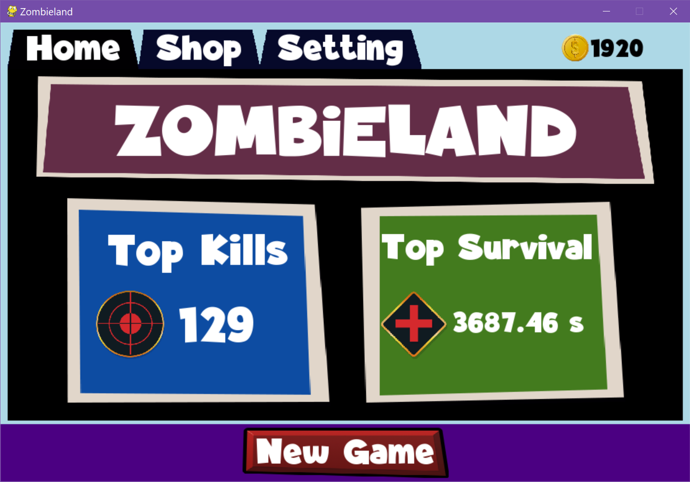

## Zombieland - Top Down Shooter Game

### 🎮 Description

In **Zombieland**, the world turns into Dead Zone and the survivors' lives are threatened with zombies. Player has to fight hordes of undead walking zombies, and try to survive as long as he can. 

### 🎨 Features

 - 2D top-down shooter style
 - Retro sound effects
 - Play as different characters
 - Collect items for survival

### 🕹 Controls

 - Aim: *Mouse Pointer*
 - Forward: **W**
 - Backward: **S**
 - Shoot: **SPACE**
 - Reload: **R**

### 🎬 Gameplay

<!--  -->

<!-- ### Developers

 - $(Developer 01) - $(Role/Tasks Developed)
 - $(Developer 02) - $(Role/Tasks Developed)
 - $(Developer 03) - $(Role/Tasks Developed)

### Links

 - YouTube Gameplay: $(YouTube Link)
 - itch.io Release: $(itch.io Game Page)
 - Steam Release: $(Steam Game Page) -->
 
### ✨ Starcatcher

If you like this project, you can support me by giving a ⭐.

## 👨‍🚀 Contact

Feel free to contact me if you're interested in this project. I'm also open to feedback and suggestions. 😉
- Email: hthant00chk@gmail.com
- LinkedIn: [@hthantoo](https://linkedin.com/in/hthantoo/)

### 📜 License

This game sources are licensed under an unmodified zlib/libpng license, which is an OSI-certified, BSD-like license that allows static linking with closed source software. Check [LICENSE](LICENSE.md) for further details.

*Copyright (c) 2022 Hein Thant ([@IndieCoderMM](https://github.com/indiecodermm/))*

